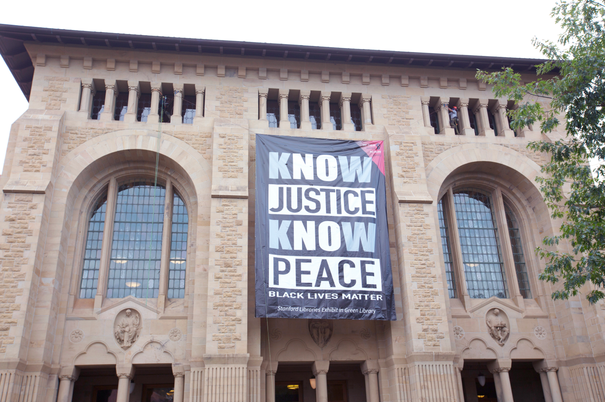
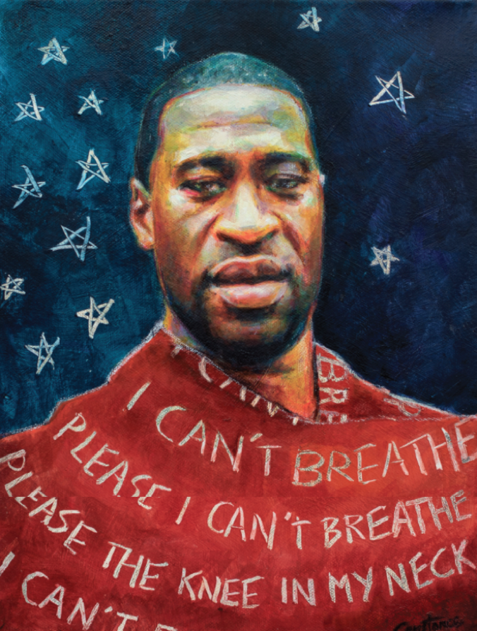

    

        

            <h3>About</h3>
            
            
In this clip, you can see George Floyd’s daughter saying, "Daddy changed the world." He absolutely did. We were inspired by him and everyone else who has suffered to create the Systemic Racism Tracker.

            
As Barack Obama said in response, "Yes, he did. Yes, we can."

        

        

            <h4>How it all began...</h4>
            
The SRT is a follow up to a statement of solidarity and support against systemic racism published by Stanford Libraries over the summer of 2020. “Making this statement reaffirming our commitment to racial justice, equity and diversity were extremely important to us. We feel compelled for the Stanford Libraries to engage directly with recent events,” said Michael Keller, vice provost and university librarian.

            
"The SRT is just one of the great ideas proposed by library staff, so I am pleased with the team effort mounting this first exhibition in a timely fashion relative to the rise of Black Lives Matter protests and the atrocities against Black Americans that extend back to the founding of this nation."

            
The concept for the exhibit was developed by Felicia A. Smith, who has published articles promoting racial literacy as well as feature stories that explore various narratives of people of color. She says the SRT was her response to the repeated claims by high ranking government officials that “Systemic racism does not exist, especially not in policing.” These statements were especially frustrating because they were made in response to questions raised following the deaths of George Floyd, Ahmaud Arbery and Breonna Taylor.

            
Coming soon ... more topics covering wealth, policing and the criminal justice system, banking, employment, housing, health care, media, military, politics, science, voting rights, education and the environment.

            
The SRT project was launched simultaneously as the <a href="https://exhibits.stanford.edu/saytheirnames">Say Their Names – No More Names Exhibit.</a>

        

    

    

        

            <iframe width="560" height="315" src="https://www.youtube.com/embed/cjGTqHFVp3I" title="YouTube video player" frameborder="0" allow="accelerometer; autoplay; clipboard-write; encrypted-media; gyroscope; picture-in-picture" allowfullscreen></iframe>
        

        

            
        

    

