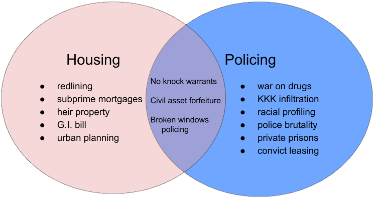

    

        <h1>Resources and Data on Systemic Racism</h1>
        
Individual policies around housing and policing have systematic impacts, and when put together, these policies re-inforce and further propogate disparities.  We are gathering data to show the interconnectedness of these policies and their impact on systemic racism in the San Francisco Bay area and California.  Here are some searches to explore:

        

            

Systemic Racism Tracker's Additional Resources

                
            

             

Articles & Books in Searchworks

                
            

        

        

            

WorldCat

                
            

            

Digital Public Library of America

                
            

        

        

            

                <h3>Examples of policies and how they intersect</h3>
                
            

            

                <h3>Watch a short film on predictive policing and "algorithmic violence"</h3>
                <iframe src="https://embed.stanford.edu/iframe?url=https://purl.stanford.edu/gq999bh9311&hide_title=true" height="300px" width="80%" title="Media viewer" frameborder="0" marginwidth="0" marginheight="0" scrolling="no" allowfullscreen></iframe>
            

        

    

