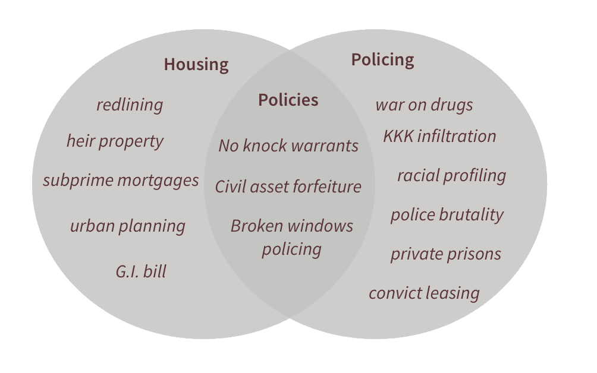

    

        <h1>Data on Systemic Racism</h1>
        

            

                
Individual policies around housing and policing have systematic impacts, and when put together, these policies re-inforce and further propogate disparities.  We are gathering data to show the interconnectedness of these policies and their impact on systemic racism in the San Francisco Bay area and California.  Here are some searches to explore:

                <ul>
                <li><a href="https://guides.library.stanford.edu/SystemicRacismTracker">Systemic Racism Tracker's Additional Resources</a> - A List of resources documenting the history of how American systems shaped by racist policies harm people of African descent.</li>
                <li><a href="https://searchworks.stanford.edu/articles?search_field=search&q=housing+AND+polic*+AND+Bay+Area">Articles in Searchworks</a> (Stanford University Libraries catalog)</li>
                <li><a href="https://searchworks.stanford.edu/?search_field=search&q=housing+AND+polic*+AND+Bay+Area">Books in Searchworks</a> (Stanford University Libraries catalog)</li>
                <li><a href="https://www.worldcat.org/search?q=housing+AND+policing+AND+Bay+Area">Worldcat</a> (worldwide network of library catalogs)</li>
                <li><a href="https://dp.la/search?q=housing+AND+police+AND+California">Digital Public Library of America</a> (digital resources from across the US)</li>
                </ul>
                <h3>Examples of policies and how they intersect</h3>
                
            

            

            
Watch a short film on predictive policing and "algorithmic violence":

            <iframe src="https://embed.stanford.edu/iframe?url=https://purl.stanford.edu/gq999bh9311&hide_title=true" height="300px" width="90%" title="Media viewer" frameborder="0" marginwidth="0" marginheight="0" scrolling="no" allowfullscreen></iframe>
            

        

    

