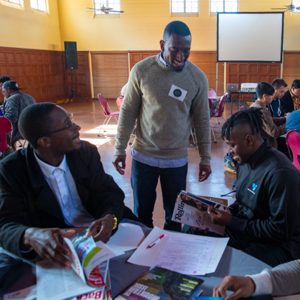

    

        

            <h3>Connect with the Community</h3>
            
When we first started, we thought this was just going to be a database with a website interface. After the first 5 interviews we did, we realized we also needed to bring people together. Professors want to know what data community organizers need to further their work, and community organizers want to know what research professors are working on. Moreover, each individual or group we spoke to had valuable data that was not preserved. 

            
This is our opportunity to bring people and data together to amplify our efforts in ending systemic racism.

        

        

           
        

        

            
        

    

    

        

            
"When historians pick up their pens to write the story of the 21st century, let them say that it was your generation who laid down the heavy burdens of hate at last and that peace finally triumphed over violence, aggression and war. So I say to you, walk with the wind, brothers and sisters, and let the spirit of peace and the power of everlasting love be your guide." - John Lewis

        

    

