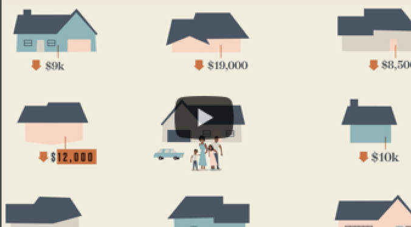
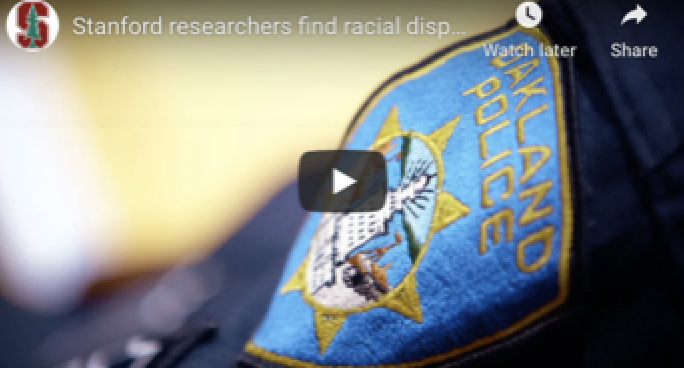
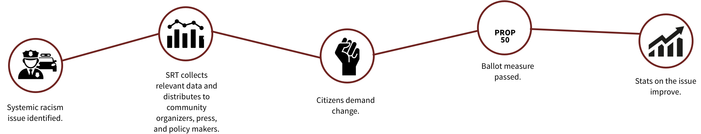



    

        

            

                
            

            

            

                Documenting Discriminiation &bull; Identifiying Interconnections &bull; Highlighting Helpers
            

        

    

    

    

        

            

                <h2>Learn about systemic racism</h2>
                
            

            

            

            

                <h2 class="text-center">Get involved</h2>
                
Help us put an end to systemic racism

                

                    

                        
                    

                    

                        
Connect with the community

                        
Create a systemtic racism tracker in your region

                    

                

            

        

    

    

        

            
        

    

    

        

            

                

                    

                        
                    

                    

                        <h3 class="feature-title">Housing</h3>
                        
If you have just a few minutes, this video clearly illustrates how the history of systemic racism in housing has led us to where we are today.  To dive deeper, head over to the <strong><a href="#">Housing page >></a></strong>

                    

                

            

            

                

                    

                        
                    

                    

                        <h3 class="feature-title">Policing</h3>
                        To get started in your journey to learn about systemic racism in policing, this video provides a concrete example in the Bay Area.  Then investigate more on the <strong><a href="#">Policing page >></a></strong>
                    

                

            

        

    

    

        

            

                Stories go here
            

        

    

    

        

            

                <h3>What is "systemic racism"?</h3>
                

                    

                        
Institutional policies, procedures, practices, regulations or processes that normalize (physical, economic, social) harm and result in outcomes that disadvantages racialized groups—people who have had a stigmatized racial identity imposed on them. Systemic racism creates disparities in many "success indicators" including wealth, policing and the criminal justice system, banking, employment, housing, health care, media, military, politics, science, voting rights, education and the environment.

                    

                    

                        
However, systemic racism can and will be defined differently by different people. We do not intend to force our definition onto you, but are providing a foundation from which to build on. The content is provided for you to come to your own conclusions.

                    

                    

                        <h4>"Not everything that is faced can be changed, but nothing can be changed until it is faced." James Baldwin</h4>
                    

                

                <h3>How do we prove systemic racism exists?</h3>
                

                    

                        
Throughout America’s democratic history, there have been "promises made" – perhaps the most well-known are "life, liberty and the pursuit of happiness." These promises are just three examples of the unalienable rights which the Declaration of Independence says have been given to all humans by their creator, cannot be taken away or denied, and which governments are created to protect.

                        
Nevertheless, these promises have been largely reserved for white people through the intentional exclusion and oppression of Black people and other racialized groups. The deep racial and ethnic inequities that exist today are a direct result of systemic racism: the historical and contemporary policies, practices, and norms that create and maintain white supremacy. People often use systemic racism, structural discrimination or institutional bias interchangeably.

                    

                    

                        
The Systemic Racism Tracker (SRT) will examine how systemic racism continues to disproportionately segregate Black people from access to services designed for upward mobility by making it more difficult for people of color to secure quality housing which limits access to education, which directly impacts employment opportunities, and is interconnected to nutrition, environment, healthcare, and equal treatment throughout the criminal justice system.

                        
The SRT will focus attention on evidence-based studies and reporting relating to the role of racism and race-based discrimination, in our public and private institutions. The SRT will offer suggestions on agencies that can help address these inequities. Our scholars and users will play a pivotal role in collecting data to educate the public about the existence of systemic racism in America, throughout history and the present day.

                    

                

                <h3>How can data help put an end to systemic racism?</h3>
                
The SRT will collect data documenting instances of institutional discrimination of Black people in America. The SRT will focus attention on evidence-based studies and reporting relating to the role of racism and race-based discrimination, in our public and private institutions. The SRT will offer suggestions on agencies and organizations that can help address these inequities. Our scholars and users will play a pivotal role in collecting data to educate the public about the existence of systemic racism in America, throughout history and the present day.

                
            

        

    

    

        

            

                Events goes here
            

        

    

    

        

            

                Education outreach info goes here
            

        

    

    

        

            

                <h2>About SRT</h2>
                
To begin we will document systemic racism in housing and policing. The SRT will highlight the interconnected systems that perpetuate those injustices and inequities. The SRT will focus on California in general and the Bay Area in particular. The initial time period of interest will be the early 20th century to the present.

                
The SRT will help users find data and other resources regarding how public and private institutions have shaped the housing and neighborhood conditions of African Americans. We selected the housing topic because there is a consensus across the political spectrum that housing discrimination against African Americans has existed (although some would argue that it faded after the federal Fair Housing Act of 1968). Neighborhoods are embedded in institutional policies and practices that influence environmental benefits (whether there are good schools, jobs, and fresh produce nearby) and detriments (whether the home is located near toxic waste that increases resident’s cancer risk or in a floodplain that makes resident’s more vulnerable to the impacts of climate change).

            

            

            

                
The SRT will also help users discover resources about how policing and the criminal justice system shape the ability or inability of African Americans to safeguard their lives and their Constitutional rights, including the right to be “secure in their persons [and] houses,” as articulated by the Fourth Amendment. We chose policing and the courts for the second topic because of the growing interest in and beyond Stanford on how African Americans are seen and treated in the criminal justice system. This concern is at the heart of the Black Lives Matter movement.

                
The SRT will document laws and regulations as well as social movements and the parallel acts of resistance and denial of equal access and equal rights through civil and criminal behaviors, atrocities, and everyday misdeeds (e.g. racial profiling). The purpose of exposing these historical and present-day linkages is to lay the groundwork for further study and teaching as well as research into these attainments and practices as ways to educate the young, students in higher education, researchers, and public policy makers. 

            

        

    




